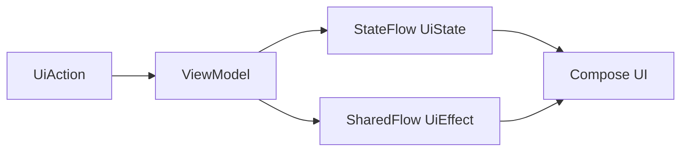

# CryptoView — Prompt final de desenvolvimento

> **Checkpoint de implementação em 25/08/2026:** o fluxo definitivo da API key,
> SQLDelight, pool/WAL, sincronização em passos, cache por demanda e polling da
> moeda expandida foram implementados. Consulte `PLANO_SINCRONIZACAO.md` e
> `TODO.md` antes de iniciar o marco de robustez, benchmark e entrega.

> **Checkpoint em 25/08/2026:** a UI mockada, a integração inicial
> `/v1/key/info` e o armazenamento seguro da API key foram implementados. O
> fluxo de criptografia foi testado e aprovado manualmente no Android e no iOS.
> Não reimplementar Keystore, CryptoKit, Keychain, DataStore ou seus contratos.
> O próximo recorte deve seguir `PROXIMOS_PASSOS.md`: integrar a credencial ao
> fluxo definitivo do aplicativo e remover a tela temporária somente após os
> novos testes passarem.

> Versão final consolidada em 24/08/2026.
>
> Este documento deve ser utilizado como especificação executável para desenvolver o desafio Android do Mercado Bitcoin. As versões e permissões da CoinMarketCap devem ser reconfirmadas no início da implementação, pois a API e os planos comerciais podem mudar.

## Papel

Atue como engenheiro mobile sênior, especialista em Kotlin Multiplatform, Compose Multiplatform, Kotlin Coroutines e Flow, Ktor/Ktorfit, SQLDelight, Koin, segurança mobile, testes automatizados e otimização de sincronização.

Desenvolva o aplicativo **CryptoView** com Android como plataforma principal da avaliação. Use Kotlin Multiplatform e Compose Multiplatform como diferencial técnico, compartilhando também a aplicação para iOS sem desviar do escopo obrigatório do desafio Android.

Antes de alterar código:

1. Apresente um plano de execução em fases.
2. Confirme a compatibilidade das versões escolhidas.
3. Liste os riscos técnicos e as limitações reais do plano da CoinMarketCap.
4. Crie uma matriz entre requisito, endpoint e campos utilizados.
5. Não avance para uma nova fase deixando erro de compilação conhecido.

## 1. Fontes oficiais

- Desafio: <https://github.com/mb-desafio/querosermb>
- CoinMarketCap API: <https://coinmarketcap.com/api/documentation/pro-api-reference>
- Autenticação: <https://coinmarketcap.com/api/documentation/guides/authentication>
- Planos e limites: <https://coinmarketcap.com/api/pricing/>

Os mockups aprovados encontram-se em `docs/mockups/` e fazem parte dos requisitos visuais.

## 2. Objetivo e diferenciais

O aplicativo deve consultar a CoinMarketCap e permitir navegar por moedas e corretoras. A entrega deve se destacar por:

- Sincronização paralela, limitada e observável.
- Persistência local-first com SQLDelight.
- Backpressure entre rede e banco.
- Batches transacionais, WAL e pool controlado de conexões.
- API key validada e persistida com segurança nativa.
- Estado imutável e fluxo unidirecional.
- Interface fluida, cache resiliente e atualização incremental.
- Polling consciente do ciclo de vida somente para a moeda selecionada.
- Testes de concorrência, cache, segurança, estado e interface.
- Decisões e resultados de benchmark documentados.

O diferencial não deve ser complexidade gratuita. Toda abstração ou dependência deve resolver um problema comprovável.

## 3. Aderência obrigatória ao desafio

O fluxo adicional orientado a moedas não substitui o requisito original de exchanges.

### Listagem de exchanges

Disponibilizar em `Mercado > Corretoras` uma lista de exchanges contendo pelo menos:

- `logo`
- `name`
- `spot_volume_usd`
- `date_launched`

### Detalhe da exchange

Ao tocar em uma exchange, abrir seu detalhe contendo pelo menos:

- `logo`
- `name`
- `id`
- `description`
- URL do website
- `maker_fee`
- `taker_fee`
- `date_launched`
- moedas/ativos com `currency.name` e `currency.price_usd`

Campos ausentes ou opcionais devem ser tratados como `nullable` e exibidos como “Não informado”. Nunca inventar valores.

### Escopo adicional do CryptoView

Como diferencial, `Mercado > Moedas` será a entrada principal e exibirá:

- Moeda, símbolo, preço e variação de 24 horas.
- Logos das principais corretoras em que a moeda é negociada.
- Indicador `+N` para as demais corretoras.
- Expansão inline com gráfico, métricas e mercados.
- Polling REST da cotação apenas enquanto a moeda estiver expandida.

## 4. Plataformas e compartilhamento

Utilizar:

- Kotlin Multiplatform.
- Compose Multiplatform para Android e iOS.
- Android como plataforma principal da avaliação.
- Host iOS mínimo para iniciar e apresentar a interface compartilhada.
- `commonMain`, `androidMain`, `iosMain`, `commonTest`, `androidUnitTest` e targets de teste iOS aplicáveis.

Compartilhar em `commonMain`:

- Interface Compose e design system.
- Navegação.
- ViewModels e estados.
- Casos de uso e modelos de domínio.
- Contratos e implementações comuns dos repositórios.
- DTOs, mapeadores e contratos Ktorfit.
- Coordenação da sincronização.
- Regras de cache e polling.
- SQLDelight e consultas.
- Contrato de armazenamento seguro.
- Tratamento de erros.
- Formatação e testes compartilháveis.

Manter específico por plataforma:

- Engine do Ktor.
- Driver e configuração SQLite/SQLDelight.
- Diretórios dos bancos e DataStore.
- Implementação do armazenamento seguro.
- Integrações de lifecycle realmente nativas.
- Bootstrap Android e iOS.

### iOS nativo

Não implementar regras de negócio ou telas duplicadas em Swift. O `iosApp` deve conter somente o necessário para:

- Inicializar Koin.
- Criar o controller Compose.
- Integrar o lifecycle do host.
- Configurar assinatura, capabilities e build.

Os contratos `expect/actual` devem fazer a ponte de engine HTTP, driver SQLDelight, caminhos, armazenamento seguro e outras APIs de plataforma.

### CocoaPods

CocoaPods **não é obrigatório** para gerar nem integrar o projeto Xcode deste aplicativo.

Preferir integração direta do framework Kotlin com o projeto Xcode por meio das tarefas Gradle do Kotlin Multiplatform. Não adicionar CocoaPods apenas porque o projeto de referência o utilizava.

Só introduzir CocoaPods se existir uma dependência iOS real distribuída exclusivamente como Pod ou uma ponte Swift inevitável. Qualquer inclusão deve ser justificada no README.

## 5. Organização do projeto

Manter os módulos principais:

### `shared`

- `core`
- `network`
- `database`
- `security`
- `data`
- `domain`
- `presentation`
- configurações e contratos de plataforma

### `composeApp`

- Aplicação Compose compartilhada.
- Tema e componentes.
- Navegação e telas.
- Recursos.
- Entrada Android.
- Controller Compose exposto ao iOS.

### `iosApp`

- Projeto Xcode mínimo.
- Bootstrap e apresentação do Compose.

Não adicionar Desktop, Web, backend ou módulos fora do escopo.

## 6. Arquitetura e estado

Adotar MVVM com Clean Architecture pragmática e fluxo unidirecional:



Regras:

- Um estado imutável por feature.
- Ações do usuário explícitas.
- Efeitos únicos separados do estado persistente.
- Sem regras de negócio em Composables.
- Sem chamadas de rede diretas na UI.
- Sem ViewModel global para eventos genéricos.
- Evitar combinações inválidas de vários booleanos desconectados.
- Cancelar trabalho obsoleto ao trocar rapidamente de item.
- Preservar scroll, aba selecionada, filtros e card expandido.
- Apenas um card de moeda expandido por vez.
- Observar SQLDelight por `Flow`; o banco é a fonte de verdade da listagem.

## 7. Dependências principais

Utilizar versões estáveis e mutuamente compatíveis de:

- Kotlin Multiplatform.
- Compose Multiplatform e Material 3.
- Kotlin Coroutines e Flow.
- Kotlin Serialization.
- Ktor Client.
- Ktorfit.
- Koin.
- SQLDelight.
- DataStore KMP para preferências e metadados não sensíveis.
- Kotlinx Datetime.
- Biblioteca de imagens KMP somente se necessária e justificada.

Centralizar versões no version catalog. Evitar APIs experimentais quando houver alternativa estável.

## 8. Configuração centralizada de processamento

Criar em `commonMain` uma única fonte para parâmetros de rede, IO, banco, cache, sincronização e polling:

```kotlin
data class CryptoProcessConfig(
    val networkParallelism: Int,
    val networkPageSize: Int,
    val responseBufferCapacity: Int,
    val databaseWriteParallelism: Int,
    val databaseBatchSize: Int,
    val databasePoolSize: Int,
    val databasePoolMaxSize: Int,
    val databaseBusyTimeoutMillis: Long,
    val walCheckpointEveryCommittedBatches: Int,
    val connectTimeoutMillis: Long,
    val requestTimeoutMillis: Long,
    val socketTimeoutMillis: Long,
    val maxRetryAttempts: Int,
    val pollingIntervalMillis: Long,
    val coinCacheTtlMillis: Long,
    val exchangeCacheTtlMillis: Long,
    val metadataCacheTtlMillis: Long,
    val marketPairsCacheTtlMillis: Long,
    val historyCacheTtlMillis: Long,
)
```

Expor a configuração por `CryptoProcessConfigUtils` e permitir perfil por plataforma sem espalhar `if (Android)` ou constantes pelas features.

Valores iniciais para benchmark:

| Parâmetro | Android | iOS |
|---|---:|---:|
| Requisições HTTP paralelas | 10 | 10 |
| Página CoinMarketCap | 100 | 100 |
| Buffer de páginas | 10 | 10 |
| Pool SQLDelight | 2 | 1 |
| Máximo do pool | 4 | 4 |
| Escritas concorrentes permitidas | 2 | 1 |
| Batch local | 1 página | 1 página |
| `busy_timeout` | 5.000 ms | 5.000 ms |
| Polling da moeda selecionada | 60 s | 60 s |

Esses valores são ponto de partida, não promessa de desempenho. Registrar benchmarks antes de alterá-los.

Sugestões iniciais de cache:

- Moedas/listagem: 5 minutos.
- Exchanges/listagem: 5 minutos.
- Metadados: 24 horas.
- Market pairs: 5 minutos.
- Histórico: cache separado por moeda/período; emitir o valor salvo imediatamente e revalidar diretamente na API ao expandir a moeda ou selecionar outro período.

## 9. API key e segurança

### Fluxo

1. Ao abrir o aplicativo sem credencial, mostrar a tela de saudação.
2. Receber a API key em campo protegido.
3. Validar por `GET /v1/key/info`.
4. Persistir somente após resposta válida.
5. Limpar o campo e o estado de UI após salvar.
6. Permitir validar novamente, substituir ou remover em Ajustes.

A API key **será persistida** para que o usuário não precise digitá-la a cada abertura.

### Contrato compartilhado

Criar `SecureApiKeyStorage` em `commonMain`, sem expor o texto puro em `StateFlow`, singleton ou logs.

### Android

- Gerar chave AES não exportável no Android Keystore.
- Usar AES-GCM.
- Gerar nonce/IV aleatório e exclusivo a cada criptografia.
- Armazenar no DataStore apenas envelope versionado, ciphertext, nonce e metadados mínimos.
- Nunca usar chave ou IV fixos.

### iOS

- Implementar o `actual` diretamente em Kotlin/Native com o framework Security.
- Armazenar a API key como item `kSecClassGenericPassword` no Keychain.
- Usar acessibilidade `ThisDeviceOnly` adequada ao ciclo do aplicativo.
- DataStore deve guardar somente metadados não sensíveis, nunca a API key em texto puro.
- Remover o item do Keychain quando o usuário apagar a credencial.

O Keychain já fornece armazenamento cifrado pelo sistema; não criar módulo Swift/CryptoKit nem adicionar CocoaPods sem necessidade real.

### Regras gerais

- Enviar a chave no header `X-CMC_PRO_API_KEY`.
- Nunca enviar a chave na query string.
- Redigir headers sensíveis no logging do Ktor.
- Não registrar token, ciphertext, nonce ou conteúdo descriptografado.
- Descriptografar/obter o segredo somente no menor escopo necessário para montar a requisição.
- Não incluir chaves em código, fixtures, CI, screenshots ou repositório.
- Se o armazenamento seguro falhar, remover o estado inválido e solicitar nova configuração.

## 10. Integração atual da CoinMarketCap

Base URL:

```text
https://pro-api.coinmarketcap.com
```

Endpoints principais validados na documentação em 24/08/2026:

| Uso | Endpoint |
|---|---|
| Validar chave e consultar uso | `/v1/key/info` |
| Quantidade global | `/v1/global-metrics/quotes/latest` |
| Mapa de moedas | `/v1/cryptocurrency/map` |
| Listagem atual de moedas | `/v3/cryptocurrency/listings/latest` |
| Cotação atual/polling | `/v3/cryptocurrency/quotes/latest` |
| Metadados de moedas | `/v2/cryptocurrency/info` |
| Histórico da moeda | `/v3/cryptocurrency/quotes/historical` |
| Corretoras que negociam a moeda | `/v2/cryptocurrency/market-pairs/latest` |
| Mapa de exchanges | `/v1/exchange/map` |
| Listagem de exchanges | `/v1/exchange/listings/latest` |
| Metadados da exchange | `/v1/exchange/info` |
| Ativos/holdings da exchange | `/v1/exchange/assets` |
| Pares da exchange | `/v1/exchange/market-pairs/latest` |
| Histórico da exchange | `/v1/exchange/quotes/historical` |

Não utilizar endpoints de criptomoedas marcados como legados quando existir a versão atual acima.

Para o gráfico de linha, usar os limites do plano Basic com no máximo 100 pontos por consulta: `24H` (`1h × 24`), `7D` (`2h × 84`), `30D` (`12h × 60`) e `1A` (`7d × 52`). O plano gratuito suporta até 1 mês intradiário e 1 ano em intervalos diários. Cada troca de período cancela somente a consulta histórica anterior; histórico não participa da sincronização global nem do polling da cotação atual.

### Restrições de plano

- O plano Basic gratuito possui atualização de aproximadamente 60 segundos e não oferece WebSocket.
- O aplicativo deve trabalhar corretamente somente com REST e polling.
- Nunca afirmar “Ao vivo” ou “Tempo real” na interface.
- Histórico, market pairs ou outros endpoints podem variar por plano e época; tratar `403` de plano sem invalidar a API key.
- Não fabricar histórico, preços, corretoras ou percentuais no build de produção.
- Fixtures são permitidas apenas em previews e testes.

## 11. Sincronização inicial de moedas

### Planejamento

1. Consultar `/v1/global-metrics/quotes/latest`.
2. Obter `data.total_cryptocurrencies` como estimativa remota.
3. Calcular as páginas usando o tamanho centralizado na configuração.
4. Respeitar eventual limite de itens acessível ao plano/endpoint.
5. Definir `targetItems` com base no total efetivamente sincronizável.
6. Criar trabalho paginado e limitado.

Nunca exibir 100% calculado apenas pela quantidade recebida da rede. O progresso deve representar registros efetivamente confirmados no banco.

### Pipeline concorrente

Implementar com coroutines estruturadas e Flow, seguindo o conceito:

```kotlin
pageIndexes
    .asFlow()
    .flatMapMerge(concurrency = config.networkParallelism) { page ->
        flow { emit(remoteDataSource.fetchCryptocurrencyPage(page)) }
    }
    .buffer(config.responseBufferCapacity)
    .collect { pageResult ->
        databaseWriter.persistPageInTransaction(pageResult)
    }
```

O código final deve incluir tratamento de erros, retry controlado, cancelamento e tipos de domínio; o trecho acima representa apenas a topologia.

Regras:

- No máximo 10 requisições simultâneas inicialmente.
- Não criar uma coroutine ilimitada por item.
- Cada página retornada deve ser mapeada e enviada imediatamente à persistência.
- Persistir uma página/batch em uma única transação.
- Se o banco estiver ocupado, suspender o produtor por backpressure.
- Não manter todas as páginas em memória.
- Uma falha de página não pode corromper batches já confirmados.
- Registrar checkpoint para permitir retomada.
- Retry automático apenas para falhas transitórias e com limite baixo.
- Respeitar `Retry-After` no `429`.
- Não repetir automaticamente erros de autenticação ou restrição de plano.

### Progresso

Manter um `SyncState` contendo:

- Fase atual.
- Total remoto informado.
- Total planejado.
- Páginas solicitadas, concluídas e com falha.
- Registros recebidos.
- Registros persistidos.
- Percentual baseado em commits.
- Horário de início e última atualização.
- Estado de cancelamento/retomada.

Atualizar a UI somente depois do commit da transação correspondente.

## 12. SQLDelight, pool e WAL

Criar um `DatabasePoolFactory` inspirado no padrão analisado, sem copiar problemas de concorrência:

- `Semaphore` limita empréstimos.
- Fila protegida por `Mutex` reutiliza conexões.
- Cada entrada possui driver/instância SQLDelight próprios apontando para o mesmo arquivo.
- Tamanho configurável entre 1 e 4.
- Android começa com 2 conexões.
- iOS começa com 1 conexão.
- Fechamento deve encerrar todos os drivers de forma segura.

Configurar WAL:

### Android

- Habilitar write-ahead logging no helper/driver compatível.
- Configurar `busy_timeout`.
- Usar `synchronous=NORMAL` quando suportado e justificado.

### iOS

- `NativeSqliteDriver` com `JournalMode.WAL`.
- `busyTimeout = 5000`.
- `SynchronousFlag.NORMAL`.

### Regra de concorrência SQLite

WAL não cria múltiplos escritores físicos simultâneos. O SQLite continua serializando a escrita. O pool serve para:

- Reutilizar conexões.
- Permitir leitura enquanto a escrita ocorre.
- Preparar batches em paralelo.
- Limitar espera e pressão sobre o banco.

O paralelismo efetivo de escrita deve permanecer configurável e ser validado por benchmark. Não vender “duas conexões” como garantia de duas escritas simultâneas.

### Transações e checkpoints

- Um batch por transação.
- Upsert idempotente.
- Índices para filtros e relações mais consultadas.
- Não executar checkpoint após cada batch pequeno.
- Usar checkpoint passivo após um número configurável de commits ou no fim da sincronização.
- Usar `TRUNCATE` apenas em manutenção/encerramento apropriado.

## 13. Modelo local e cache

Persistir ao menos:

- Moedas e cotações atuais.
- Metadados das moedas.
- Exchanges.
- Metadados das exchanges.
- Relações moeda–exchange/market pairs.
- Ativos da exchange.
- Pontos históricos.
- Estado e checkpoints da sincronização.
- Horário da última atualização por recurso.

Regras:

1. Ler e emitir cache imediatamente.
2. Verificar TTL.
3. Atualizar remotamente quando necessário.
4. Persistir atomicamente.
5. Deixar a UI reagir ao banco.
6. Se a rede falhar, manter conteúdo anterior e marcar como desatualizado.

Não apagar cache válido antes de confirmar uma nova resposta.

## 14. Polling da moeda selecionada

Não implementar WebSocket neste teste.

Ao expandir uma moeda:

1. Emitir imediatamente o conteúdo local.
2. Consultar `/v3/cryptocurrency/quotes/latest` para o ID selecionado.
3. Persistir a cotação recebida.
4. Aguardar 60 segundos.
5. Repetir enquanto a moeda continuar expandida e a tela estiver ativa.

Regras:

- Usar intervalo de `CryptoProcessConfigUtils`.
- Iniciar somente para o card expandido.
- Cancelar ao recolher o card, trocar de moeda, sair da tela ou colocar o app em background.
- Usar `flatMapLatest`/cancelamento estruturado para eliminar polling anterior.
- Não fazer polling de todas as moedas da lista.
- Evitar chamadas duplicadas por recomposição.
- Em erro, manter o último valor e informar discretamente que a atualização falhou.
- Retomar respeitando o lifecycle.

Texto visual aprovado:

```text
Atualizado há 12 s · atualiza a cada 60 s
```

Na lista geral, usar somente algo como:

```text
Atualizado há 1 min
```

## 15. Interface e experiência

Nome: **CryptoView**.

Tema:

- Material 3.
- Fundo branco levemente quente.
- Laranja como cor principal.
- Superfícies brancas.
- Cinzas neutros.
- Verde para variação positiva.
- Vermelho suave para variação negativa.
- Pouca elevação e bordas discretas.
- Tema escuro equivalente.
- Contraste e áreas de toque acessíveis.

### Navegação inferior

Exatamente dois destinos:

- `Mercado`
- `Ajustes`

Não criar item separado de moedas, exchanges ou sincronização na navegação inferior.

### Mercado

Cabeçalho:

- Título `Mercado` à esquerda.
- `IconButton` de busca ao lado direito.
- `IconButton` de filtros ao lado direito.
- Ícones sem caixas no estado inativo.
- Filtro pode usar fundo laranja suave quando ativo.

Abas internas:

- Trilho horizontal arredondado em laranja opaco/suave.
- Aba selecionada branca, levemente elevada e com texto laranja.
- Aba não selecionada permanece no trilho laranja com texto branco.
- Opções: `Moedas` e `Corretoras`.

### Busca

- Fechada por padrão.
- Ao tocar na lupa, expandir campo de texto com animação.
- Exibir ícone de limpar/fechar.
- Debounce curto para busca local.
- Não realizar requisição por caractere digitado.
- Buscar primeiro no banco sincronizado.

### Filtros de moedas

Expandir verticalmente um painel contendo filtros básicos:

- Ordenar por: capitalização ou preço.
- Variação 24h: todas, positivas ou negativas.
- Corretora: todas ou corretoras disponíveis localmente.
- Ações `Limpar` e `Aplicar`.

### Lista de moedas

Cada card compacto deve mostrar:

- Logo.
- Nome e símbolo.
- Preço.
- Variação 24h.
- Até três logos sobrepostos de corretoras.
- Indicador `+N`.
- Indicador de expansão.

Usar `LazyColumn`, chaves estáveis e conteúdo vindo do banco.

### Moeda expandida

- Apenas um card aberto.
- Animação suave.
- Polling iniciado sob demanda.
- Metadado discreto da última atualização.
- Gráfico das últimas 24 horas.
- Mínimo, máximo e volume de 24h.
- Corretoras em que a moeda é negociada.
- Ação `Ver todas`.
- Estados independentes para cotação, gráfico e mercados.

### Aba Corretoras

Cada card deve mostrar:

- Logo.
- Nome.
- Ranking.
- Volume spot em 24 horas.
- Data de lançamento.
- Quantidade de moedas quando disponível.
- Acesso ao detalhe obrigatório.

### Detalhe da exchange

Exibir todos os campos exigidos pelo desafio e a lista completa de ativos/moedas retornada por `/v1/exchange/assets`.

Não confundir:

- `/v1/exchange/assets`: holdings/ativos da exchange e requisito do detalhe.
- `/v2/cryptocurrency/market-pairs/latest`: mercados em que uma moeda é negociada.
- `/v1/exchange/market-pairs/latest`: pares negociados dentro de uma exchange.

### Sincronização

Mostrar modal com:

- Título `Sincronizando mercado`.
- Percentual baseado em commits.
- `X de Y moedas`.
- Barra de progresso.
- Estado como `Salvando dados no dispositivo`.
- Mensagem `Você pode continuar usando o app.`
- Ações `Executar em segundo plano` e `Cancelar`.

Não expor threads, batches, WAL, pool, requests ou outros detalhes técnicos ao usuário.

“Executar em segundo plano” significa continuar a sincronização enquanto o usuário navega pelo aplicativo. Não prometer execução indefinida após suspensão do processo pelo iOS. Salvar checkpoint e retomar quando necessário.

### Ajustes

Disponibilizar:

- Status da API key sem revelar o valor.
- Validar novamente.
- Substituir.
- Remover.
- Informações de uso retornadas por `/v1/key/info`.
- Última sincronização.
- Ação de sincronização manual.
- Limpeza de cache com confirmação.
- Informação de que a moeda selecionada atualiza a cada 60 segundos.

## 16. Gráfico

Criar componente compartilhado em Compose, preferencialmente com Canvas:

- Linha laranja.
- Gradiente suave.
- Escala proporcional.
- Pontos das últimas 24 horas.
- Mínimo e máximo.
- Loading, vazio, erro e restrição de plano.
- Resumo textual acessível.
- Layout responsivo.

Não usar WebView. Não gerar dados aleatórios no build de produção.

## 17. Injeção de dependências

Utilizar Koin com injeção por construtor.

Separar módulos:

- `platformModule`
- `networkModule`
- `databaseModule`
- `securityModule`
- `repositoryModule`
- `useCaseModule`
- `viewModelModule`

Usar singleton para cliente HTTP, banco, DataStore, pool e repositórios stateless. Usar factory para ViewModels conforme o ciclo de vida. Não usar Koin como service locator dentro de regras de negócio.

## 18. Tratamento de erros

Criar hierarquia de erros de domínio:

- Sem conexão.
- Timeout.
- API key ausente.
- API key inválida.
- Recurso indisponível no plano.
- Rate limit.
- Servidor indisponível.
- Resposta inválida.
- Serialização.
- Cache/banco.
- Criptografia/Keychain/Keystore.
- Cancelamento.
- Desconhecido.

Comportamentos:

- `401`: revisar credencial.
- `403`: distinguir chave inválida de restrição do plano quando possível.
- `429`: respeitar `Retry-After`.
- `5xx`, timeout e falha de rede: retry limitado com backoff e jitter.
- Cache disponível: manter conteúdo e apresentar aviso não bloqueante.
- Falha de uma seção do card não deve derrubar as demais.

## 19. Desempenho e observabilidade

- Nunca bloquear a main thread com rede, parsing ou SQL.
- Medir tempo total, tempo por página, espera do pool e tempo por transação.
- Logs estruturados sem informações sensíveis.
- Contadores de páginas, registros e retries.
- `LazyColumn` com chaves estáveis.
- Evitar objetos e formatadores recriados em recomposição.
- Carregar imagens com cache e placeholder.
- Usar índices SQL para busca, ordenação e relacionamentos.
- Não fazer N+1 de metadados se o endpoint aceitar IDs em lote.

Criar benchmark comparando:

- Rede sequencial.
- Paralelismo 5.
- Paralelismo 10.
- Pool 1 versus 2 no Android.
- Diferentes tamanhos de batch.

Registrar aparelho/emulador, volume de dados e resultados no README. Não afirmar ganho sem medição.

## 20. Testes

### Compartilhados

Cobrir:

- Validação da API key.
- DTOs e mapeadores.
- Casos de uso.
- Regras de cache.
- Repositórios local-first.
- Coordenação da sincronização.
- Limite de paralelismo.
- Backpressure.
- Batch e retomada após falha.
- Progresso somente após commit.
- Cancelamento.
- Polling da moeda selecionada.
- Troca rápida de card.
- Tratamento de `401`, `403`, `429`, `5xx` e offline.
- ViewModels e transições de estado.
- Busca e filtros locais.

Usar Ktor `MockEngine`; testes automatizados não devem depender da API real.

### Banco

- Upsert idempotente.
- Rollback de batch incompleto.
- Múltiplas conexões.
- WAL e timeout conforme o driver permitir testar.
- Leituras durante sincronização.
- Checkpoint e encerramento do pool.

### Segurança

- Salvar, ler e remover segredo.
- Android: AES-GCM, nonces diferentes e falha ao adulterar ciphertext.
- iOS: criar, atualizar, consultar e remover item do Keychain.
- Falha de chave ausente/inválida.
- Ausência de segredo em logs e estado de UI.

### Interface Android

- Onboarding.
- Chave inválida.
- Lista de moedas.
- Abas Moedas/Corretoras.
- Busca expandida.
- Filtros expandidos.
- Card expandido.
- Polling discreto.
- Detalhe da exchange e seus ativos.
- Modal de sincronização.
- Offline/cache desatualizado.
- Rotação e tamanhos diferentes.
- Acessibilidade básica.

### iOS

- Compilar o target.
- Inicializar Koin.
- Inicializar a interface Compose.
- Executar testes compartilhados para target iOS.
- Validar Keychain quando o ambiente permitir.

Sem macOS/Xcode disponível, configurar CI em runner macOS e não afirmar teste manual sem evidência.

## 21. CI e qualidade

Criar GitHub Actions para:

- Build Android.
- Testes unitários.
- Testes compartilhados.
- Lint/análise estática adotada.
- Build do framework/target iOS em runner macOS.

A CI não pode exigir API key real. Utilizar fakes e fixtures.

Adicionar `.gitignore` adequado e verificar o histórico por segredos antes da entrega.

## 22. README da entrega

Incluir:

- Objetivo e aderência ao desafio.
- GIF ou screenshots dos mockups implementados.
- Arquitetura e módulos.
- Tecnologias.
- Decisões KMP/iOS e ausência de CocoaPods.
- Cadastro e segurança da API key.
- Endpoints utilizados.
- Estratégia local-first.
- Fluxo de sincronização e backpressure.
- Pool, WAL e limitações reais do SQLite.
- Polling de 60 segundos e ausência de WebSocket no plano gratuito.
- Testes e CI.
- Benchmark com metodologia e resultados.
- Instruções Android e iOS.
- Limitações reais do plano da CoinMarketCap.
- Trade-offs e melhorias futuras.

Não pedir ao avaliador para editar `local.properties` ou código para inserir a API key. O cadastro acontece na UI.

## 23. Fases de implementação

### Fase 1 — Descoberta

- Revisar desafio e documentação.
- Matriz requisito–endpoint–campo.
- Confirmar plano da chave de teste.
- Definir versões compatíveis.
- Registrar riscos.

### Fase 2 — Bootstrap KMP

- Criar módulos e source sets.
- Configurar Compose, Koin e version catalog.
- Configurar hosts Android/iOS sem CocoaPods.
- Validar builds vazios.

### Fase 3 — Segurança

- Criar `SecureApiKeyStorage`.
- Android Keystore/AES-GCM.
- iOS Keychain.
- DataStore para metadados.
- Onboarding, validação e testes.

### Fase 4 — Rede e domínio

- Configurar Ktor/Ktorfit.
- DTOs e mapeadores.
- Erros de domínio.
- Redação de logs.
- Fakes e MockEngine.

### Fase 5 — Banco

- Schema e índices.
- Drivers por plataforma.
- WAL.
- `DatabasePoolFactory`.
- Repositórios local-first.

### Fase 6 — Sincronização

- Quantidade global.
- Paginação.
- Paralelismo 10.
- Buffer e backpressure.
- Transações por batch.
- Progresso por commit.
- Retomada e cancelamento.

### Fase 7 — Mercado

- Tema e componentes.
- Tabs Moedas/Corretoras.
- Busca e filtros.
- Listas observando banco.
- Estados vazio, loading, erro e cache.

### Fase 8 — Detalhes e polling

- Expansão da moeda.
- Gráfico e market pairs.
- Polling de 60 segundos.
- Detalhe da exchange.
- Lista obrigatória de ativos.

### Fase 9 — Qualidade e entrega

- Testes restantes.
- Benchmark.
- Acessibilidade.
- CI.
- README.
- Screenshots/GIF.
- Revisão de segredos e requisitos.

## 24. Critérios de aceite

A entrega estará concluída quando:

- Android compilar, executar e atender integralmente ao desafio.
- Target iOS compilar com UI compartilhada.
- Não houver regra de negócio duplicada em Swift.
- CocoaPods não tiver sido adicionado sem justificativa real.
- API key puder ser validada e persistida pela UI.
- Android usar Keystore/AES-GCM.
- iOS usar Keychain.
- Nenhuma chave aparecer em código, banco comum, logs ou CI.
- Lista de moedas vier do banco após sincronização.
- Lista e detalhe de exchanges exibirem os campos obrigatórios.
- Ativos da exchange forem apresentados.
- Até 10 requisições forem processadas em paralelo, com limite verificável.
- Cada página for persistida em transação assim que retornar.
- Pool, WAL e backpressure estiverem implementados e testados.
- Progresso representar registros confirmados no banco.
- Busca e filtros funcionarem localmente.
- Apenas um card ficar expandido.
- Polling ocorrer somente para a moeda selecionada, a cada 60 segundos.
- A UI não usar “Ao vivo” ou “Tempo real”.
- Cache offline e estado desatualizado funcionarem.
- Erros e restrições de plano forem tratados sem dados fictícios.
- Testes relevantes e CI estiverem verdes.
- README documentar arquitetura, segurança, benchmark e limitações.
- Não existirem TODOs ligados aos requisitos obrigatórios.

## 25. Forma de trabalho e entrega do agente

Durante a implementação:

1. Execute uma fase por vez.
2. Informe brevemente o que foi concluído.
3. Rode os testes relevantes após cada etapa.
4. Corrija falhas de compilação antes de avançar.
5. Não esconda limitações nem resultados negativos.
6. Não introduza dependência sem justificativa.
7. Não faça push, publique builds ou exponha credenciais sem autorização.

Ao finalizar, apresentar:

- Resumo do que foi implementado.
- Arquivos principais.
- Testes e builds executados com resultados.
- Evidências de desempenho.
- Limitações restantes.
- Próximos passos recomendados.

## 26. Referências visuais obrigatórias

| Estado | Arquivo |
|---|---|
| Saudação e API key | `docs/mockups/01-onboarding-api-key.png` |
| Lista de moedas | `docs/mockups/02-mercado-moedas.png` |
| Busca e filtros | `docs/mockups/03-mercado-busca-filtros.png` |
| Moeda expandida e polling | `docs/mockups/04-mercado-moeda-expandida.png` |
| Lista de corretoras | `docs/mockups/05-mercado-corretoras.png` |
| Modal de sincronização | `docs/mockups/06-sincronizacao.png` |

Os mockups definem hierarquia, componentes, textos principais e identidade. Ajustes menores de espaçamento são permitidos para acessibilidade e diferentes dimensões, sem alterar a arquitetura de navegação aprovada.
