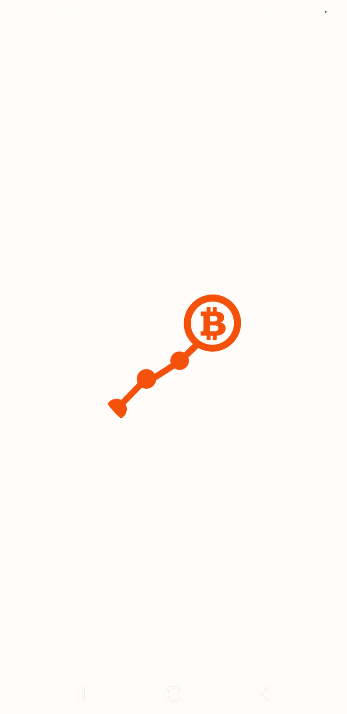
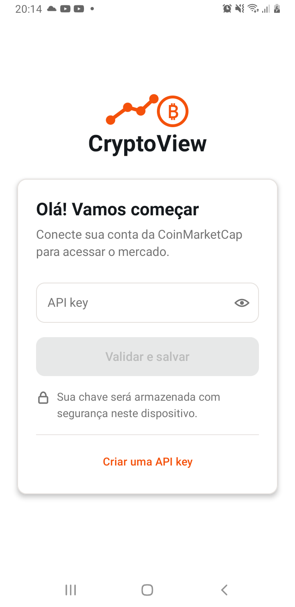
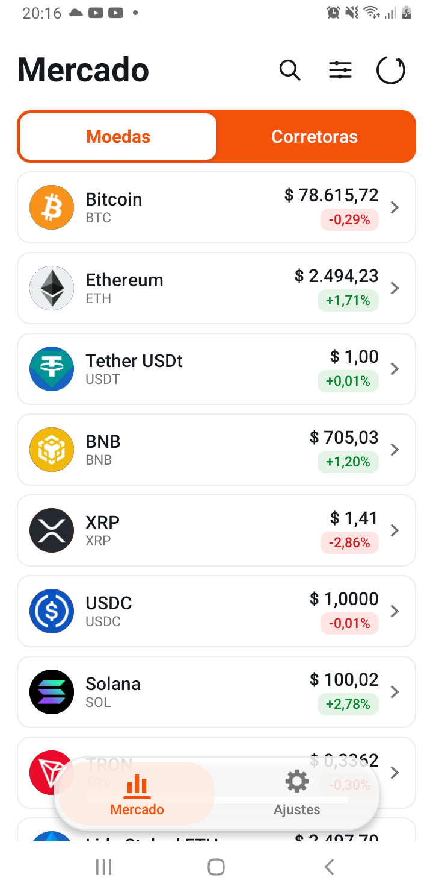
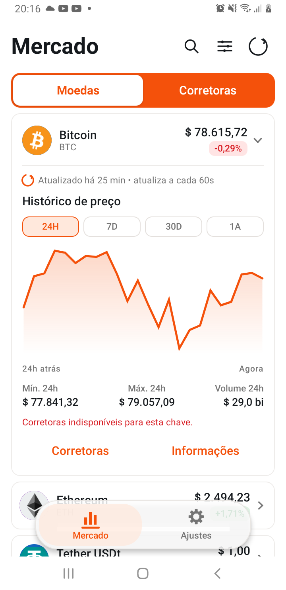
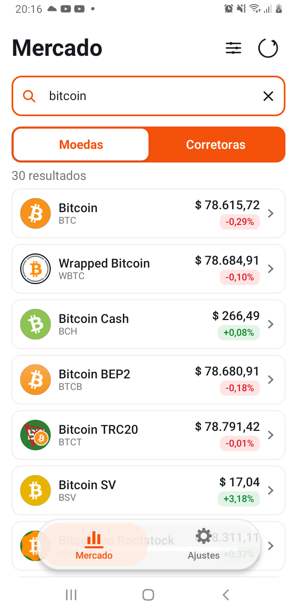
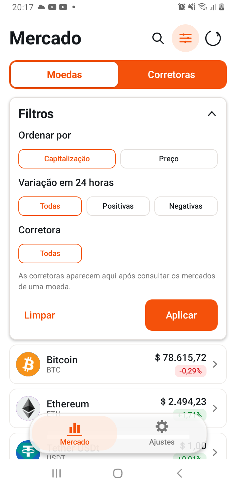
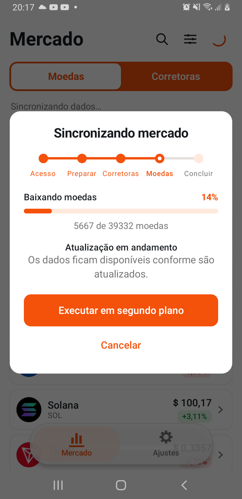
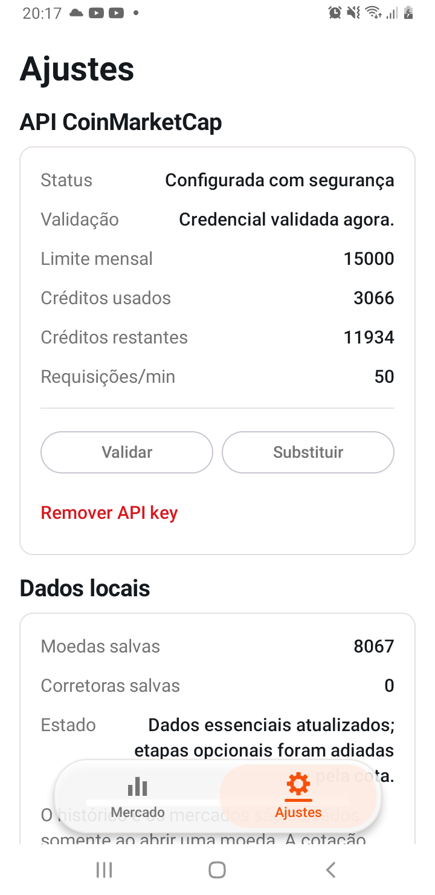
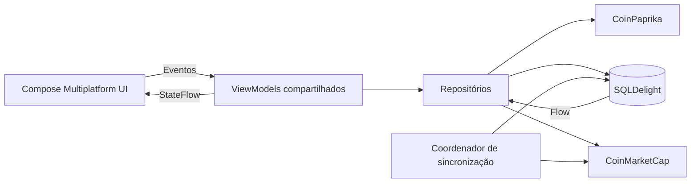
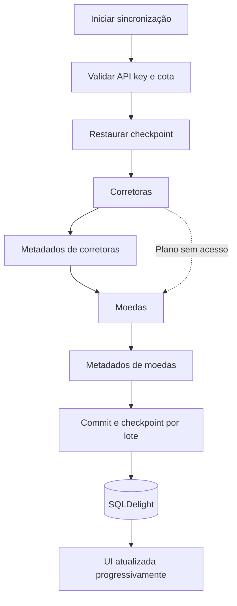

# CryptoView

Aplicativo Kotlin Multiplatform criado para o [desafio mobile do Mercado Bitcoin](https://github.com/mb-desafio/querosermb). O app consulta moedas e corretoras, mantém os dados localmente e compartilha interface, estado e regras de negócio entre Android e iOS.

## Principais recursos

- Onboarding com validação e armazenamento seguro da API key.
- Listas paginadas de moedas e corretoras, busca e filtros locais.
- Detalhe da moeda com cotação, gráfico por período, mercados e atualização a cada 60 segundos enquanto expandida.
- Detalhe da corretora com metadados e preços dos ativos.
- Informações complementares da moeda fornecidas pela CoinPaprika.
- Sincronização incremental com progresso, cancelamento, checkpoint e retomada.
- Cache local-first: a interface observa o banco e continua útil quando a rede falha.
- Tema claro/escuro e layout adaptável para telefone e telas maiores.

## Telas Android

<table>
  <tr>
    <td align="center"><strong>Splash</strong></td>
    <td align="center"><strong>Onboarding</strong></td>
    <td align="center"><strong>Mercado</strong></td>
    <td align="center"><strong>Detalhe da moeda</strong></td>
  </tr>
  <tr>
    <td></td>
    <td></td>
    <td></td>
    <td></td>
  </tr>
  <tr>
    <td align="center"><strong>Busca</strong></td>
    <td align="center"><strong>Filtros</strong></td>
    <td align="center"><strong>Sincronização</strong></td>
    <td align="center"><strong>Ajustes</strong></td>
  </tr>
  <tr>
    <td></td>
    <td></td>
    <td></td>
    <td></td>
  </tr>
</table>

O aplicativo também foi validado manualmente no iOS. As capturas dessa plataforma serão adicionadas posteriormente.

## Arquitetura e estado

O projeto utiliza **MVVM**, fluxo unidirecional de dados e abordagem **local-first**. Os ViewModels compartilhados expõem estados imutáveis por `StateFlow`; a UI envia eventos e observa o estado considerando o ciclo de vida. O SQLDelight é a fonte de verdade para as telas.



Responsabilidades principais:

- **UI:** Compose Multiplatform, Navigation 3, componentes reutilizáveis e estados de loading/erro/cache.
- **Estado:** ViewModels compartilhados, `StateFlow`, eventos explícitos e estado imutável.
- **Domínio:** repositórios e modelos sem dependência das telas.
- **Dados:** Ktor/Ktorfit, SQLDelight, cache por recurso e mapeamento de DTOs.
- **Injeção:** Koin com módulos de rede, banco, segurança, repositórios e ViewModels.

## Sincronização

A sincronização valida a credencial e a cota, restaura checkpoints e baixa páginas em paralelo. Cada lote é salvo em transação; somente depois do commit o progresso é confirmado. Backpressure, limite de requisições e retry controlam a pressão sobre rede e SQLite.



Histórico, mercados da moeda, ativos da corretora e informações CoinPaprika ficam fora da sincronização global e são carregados apenas quando necessários.

## Segurança da API key

- **Android:** chave AES-256 não exportável no Android Keystore e envelope AES-GCM persistido no DataStore.
- **iOS:** CryptoKit e chave protegida pelo Keychain.
- A API key não faz parte do estado da UI e é recuperada somente no limite da requisição autenticada.
- Headers e credenciais são redigidos dos logs.

## Tecnologias

| Área | Tecnologia |
|---|---|
| Plataforma | Kotlin Multiplatform, Android e iOS |
| Interface | Compose Multiplatform, Material 3, Navigation 3 |
| Estado | MVVM, StateFlow, Coroutines e Flow |
| Rede | Ktor, Ktorfit e Kotlin Serialization |
| Persistência | SQLDelight, WAL e transações por lote |
| Injeção | Koin |
| Imagens | Coil |

## Executando o projeto

Pré-requisitos: JDK 17, Android Studio com Android SDK 36 e, para iOS, macOS com Xcode.

```bash
# Compilar o aplicativo Android
bash gradlew :androidApp:assembleDebug

# Executar os testes compartilhados no host Android
bash gradlew :shared:testAndroidHostTest
```

Para Android, abra o projeto no Android Studio e execute `androidApp`. Para iOS, abra `iosApp/iosApp.xcodeproj` no Xcode. A API key da CoinMarketCap é informada e validada no primeiro acesso; nenhuma credencial precisa ser adicionada ao código.

## Validação

- 53 testes automatizados de domínio, rede, segurança, sincronização, paginação e banco aprovados no host Android.
- Build Android e compilação compartilhada para iOS aprovados.
- Fluxos principais validados manualmente em dispositivos Android e iOS.

## Limitações conhecidas

- O plano gratuito da CoinMarketCap pode responder `403` para corretoras, ativos, market pairs ou histórico. A falha é isolada e não impede a sincronização das moedas disponíveis.
- Não existe fallback CoinPaprika para corretoras. A CoinPaprika é usada somente para informações complementares das moedas.
- A associação entre CoinMarketCap e CoinPaprika é estrita; quando não há correspondência segura, a ação de informações permanece indisponível.
- A galeria atual contém apenas capturas Android.

Dados de mercado: [CoinMarketCap](https://coinmarketcap.com/api/). Informações complementares: [CoinPaprika](https://coinpaprika.com/api/).
