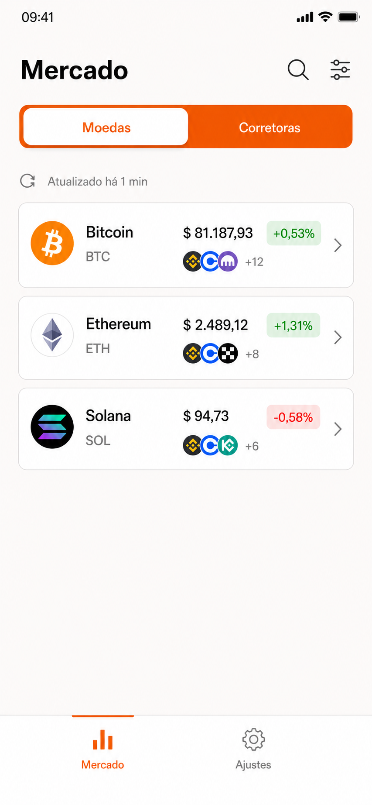
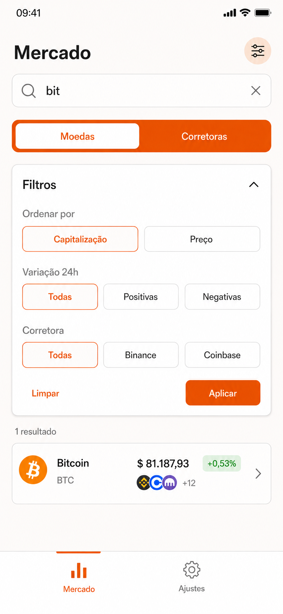
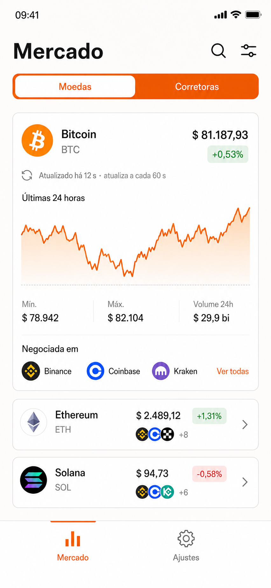
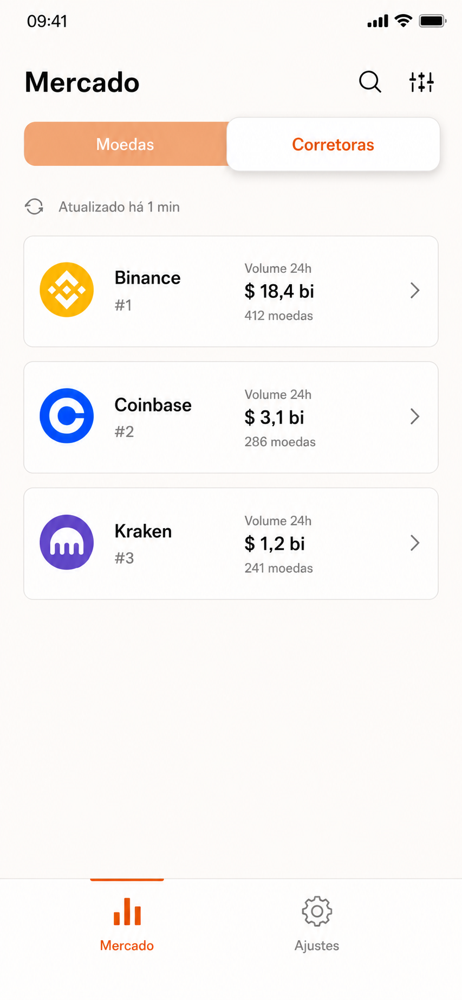
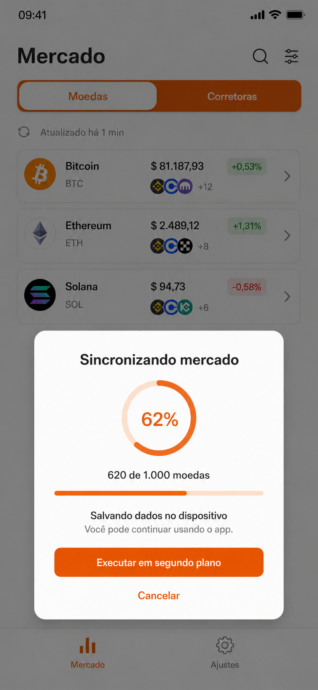

# CryptoView — pacote de especificação

Este pacote contém a especificação final e os mockups aprovados para o desafio técnico CryptoView.

## Conteúdo

- [`PROMPT_DESENVOLVIMENTO.md`](PROMPT_DESENVOLVIMENTO.md): prompt completo e executável.
- `docs/mockups/01-onboarding-api-key.png`
- `docs/mockups/02-mercado-moedas.png`
- `docs/mockups/03-mercado-busca-filtros.png`
- `docs/mockups/04-mercado-moeda-expandida.png`
- `docs/mockups/05-mercado-corretoras.png`
- `docs/mockups/06-sincronizacao.png`

## Sequência visual

### 1. Onboarding e API key

### 2. Mercado — moedas

### 3. Busca e filtros

### 4. Moeda expandida

### 5. Mercado — corretoras

### 6. Sincronização

